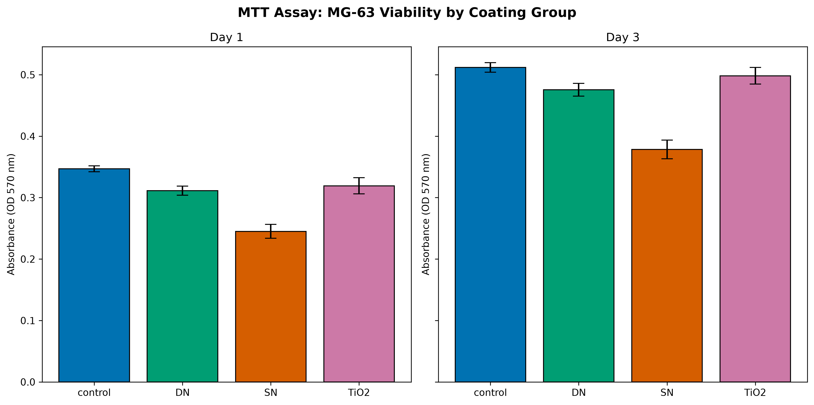
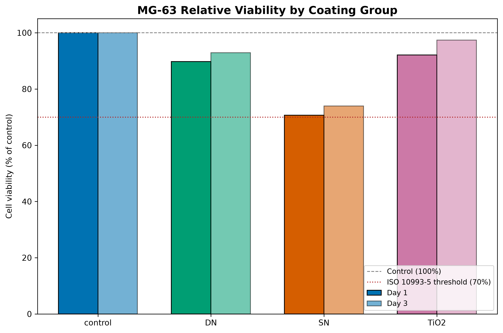
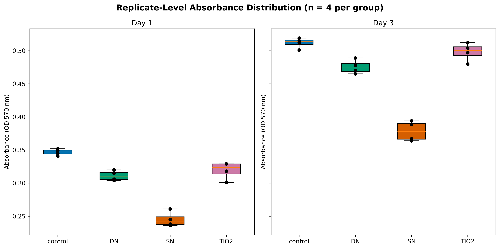
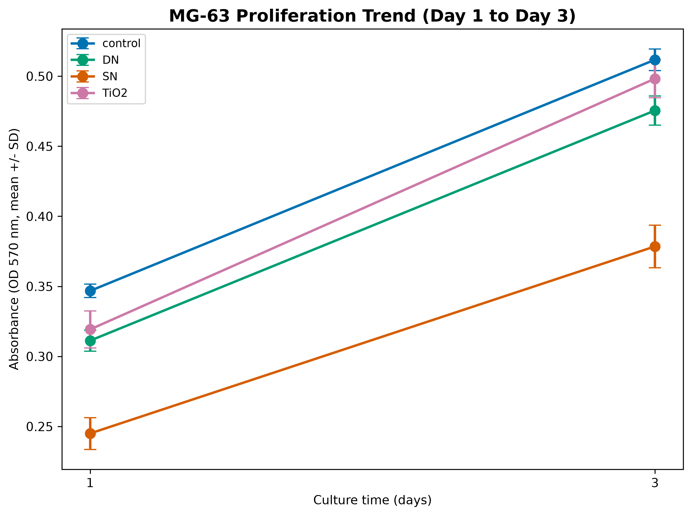
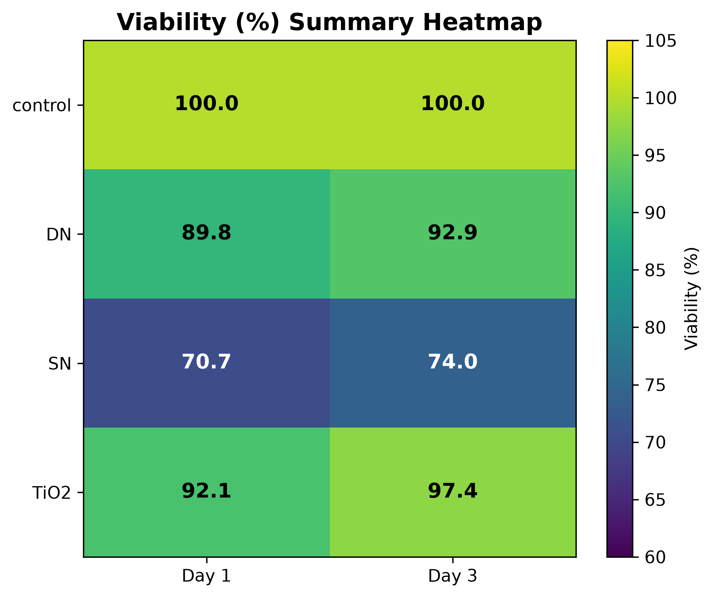

# MTT Assay Analysis: MG-63 Viability on TiO2/Sr-Coated 316L Stainless Steel

This project analyzes experimental MTT assay data generated during my Master's research on
electrospun TiO2/Sr nanofiber coatings deposited on 316L stainless steel for orthopedic implant
applications. The coatings were fabricated by single-nozzle (SN) and dual-nozzle (DN)
electrospinning, and were evaluated for biocompatibility and bioactivity using MG-63
osteoblast-like cells. All absorbance values in this repository are original experimental
measurements collected in the laboratory (plate-reader OD 570 nm readings) — not simulated or
synthetic data.

## Background

316L stainless steel is widely used in orthopedic implants due to its favorable mechanical
strength, wear resistance, and low cost compared to titanium alloys. However, its bioinert
surface limits effective bone cell response and osseointegration, and its corrosion in
physiological fluids can release toxic metal ions. Surface modification with bioactive
nanofiber coatings is a common strategy to address this limitation.

TiO2 (titanium dioxide) nanofiber coatings are widely studied for improving the
osteoconductivity of non-titanium metallic implants. Strontium (Sr) doping is added because
strontium ions are known to have a dual regulatory effect on bone metabolism: at appropriate
concentrations, they stimulate osteoblast proliferation and differentiation while inhibiting
osteoclast activity, making them a well-established additive for enhancing implant
osseointegration.

Two electrospinning configurations were compared in this project: single-nozzle (SN), where
TiO2 and Sr precursors are combined into a single spinning solution, and dual-nozzle (DN),
where TiO2 and Sr-containing fibers are deposited separately from two nozzles onto the same
mat. The dual-nozzle configuration is expected to allow more controlled incorporation of a
second component compared to single-nozzle blending, since not all precursor combinations
can be uniformly co-spun through a single nozzle.

This repository focuses specifically on the cell-viability (MTT assay) arm of the parent
thesis, which evaluates whether these coatings support MG-63 osteoblast-like cell
attachment, viability, and proliferation without cytotoxic effects — a prerequisite step
before further bioactivity characterization (SEM, XRD, EDS, ALP assay).

## Experimental Design

- **Cell line:** MG-63 (human osteosarcoma / osteoblast-like)
- **Assay:** MTT (3-(4,5-dimethylthiazol-2-yl)-2,5-diphenyltetrazolium bromide) colorimetric
  viability assay
- **Substrate:** 316L stainless steel, coated with electrospun nanofibers (except control)
- **Groups:**
  - `control` — cells cultured directly on tissue-culture polystyrene (TCP), no metal substrate
  - `TiO2` — 316L coated with electrospun TiO2 nanofibers only
  - `SN` — 316L coated with TiO2/Sr nanofibers, single-nozzle electrospinning
  - `DN` — 316L coated with TiO2/Sr nanofibers, dual-nozzle electrospinning
- **Time points:** Day 1 and Day 3 of culture
- **Replicates:** n = 4 per group per time point
- **Readout:** absorbance at 570 nm (spectrophotometer / plate reader), proportional to
  metabolically active (viable) cell number

  ## Key Results

- All four groups exceed the ISO 10993-5 cytocompatibility threshold (viability > 70% of
  control) at both time points.
- One-way ANOVA showed a highly significant effect of coating group on absorbance at both
  Day 1 (F = 77.67, p < 0.0001, eta-squared = 0.951) and Day 3 (F = 99.05, p < 0.0001,
  eta-squared = 0.961) — coating type explains ~95-96% of the variance observed.
- Tukey HSD post-hoc testing showed the single-nozzle TiO2/Sr (SN) coating consistently
  underperforms all other groups (lowest viability, ~71-74%), while the dual-nozzle TiO2/Sr
  (DN) coating is statistically indistinguishable from plain TiO2 at both time points,
  supporting dual-nozzle electrospinning as the preferred fabrication route for Sr-doped
  coatings.
- All groups show statistically significant proliferation from Day 1 to Day 3
  (fold-change 1.48x-1.56x, p < 0.0001 for all groups), confirming sustained metabolic
  activity, not just initial attachment.

  ## Figures

| Absorbance by group (mean +/- SD) | Viability (%) vs. ISO threshold |
|---|---|
|  |  |

| Replicate distribution | Proliferation trend | Viability heatmap |
|---|---|---|
|  |  |  |

## Statistical Methods

1. **Normality:** Shapiro-Wilk test per group (all groups p > 0.05, consistent with normality).
2. **Homogeneity of variance:** Levene's test per day (p > 0.05, consistent with equal
   variances).
3. **Group comparison:** one-way ANOVA per time point, with eta-squared effect size.
4. **Post-hoc:** Tukey HSD pairwise comparisons (family-wise alpha = 0.05).
5. **Temporal comparison:** independent-samples Welch's t-test comparing Day 1 vs. Day 3
   absorbance within each group, plus fold-change. An independent (not paired) test was used
   because the MTT assay is destructive: each well is measured once, so Day 1 and Day 3
   replicates are physically different samples.

**Limitation:** with n = 4 replicates per group, the statistical power of the Shapiro-Wilk
and Levene's tests to detect departures from their assumptions is limited. Both assumption
checks are reported for transparency, but only extreme violations would be reliably
detected at this sample size.

## Repository Structure

```
.
├── data/
│   ├── rofoee.xlsx              # raw Excel file from the laboratory
│   └── mtt_tidy.csv             # tidy long-format dataset (generated)
├── src/
│   ├── build_dataset.py         # extracts raw data into a tidy CSV
│   ├── analysis.py              # full statistical pipeline
│   └── visualize.py             # generates all figures
├── figures/                     # generated PNG figures (300 dpi)
├── report/                      # CSV exports of every statistical test
├── README.md
```

## Installation

```bash
git clone https://github.com/Shahrzad-Rofoee/mtt-mg63-viability-analysis.git
cd mtt-mg63-viability-analysis
pip install pandas numpy scipy matplotlib seaborn openpyxl statsmodels
```

## Usage

```bash
python src/build_dataset.py      # build data/mtt_tidy.csv
python src/analysis.py           # run full statistical pipeline -> report/*.csv
python src/visualize.py          # generate figures -> figures/*.png
```

## Citation

If you use this pipeline or reference this work, please cite it as:

```
Rofoee, S. (2026). MTT Assay Analysis: MG-63 Osteoblast Viability on TiO2/Sr Electrospun-Coated
316L Stainless Steel [Software]. https://github.com/Shahrzad-Rofoee/mtt-mg63-viability-analysis
```

## Tech Stack

`pandas` - `numpy` - `scipy` - `statsmodels` - `matplotlib`

## Author

Prepared as part of M.Sc. materials engineering research on surface-modified orthopedic implant
substrates (electrospun TiO2/Sr nanofiber coatings on 316L stainless steel). Feedback and
collaboration inquiries welcome.

## License

Released under the MIT License. See the [LICENSE](LICENSE) file for details.